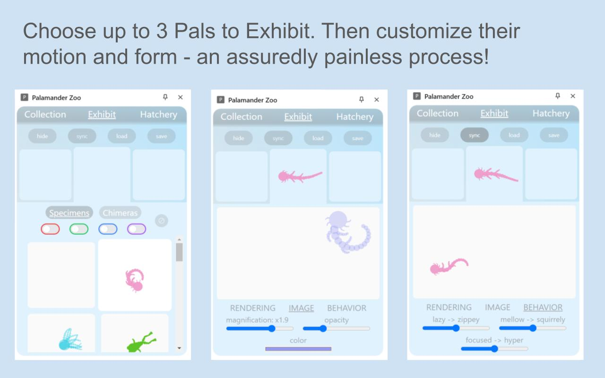
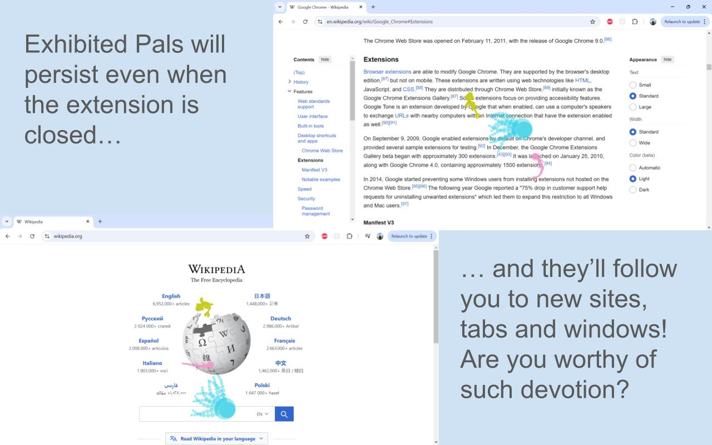

# Palamander Zoo
A... Zoo? For your... Palamanders?

The open source project for the Palamander Zoo Chrome Extension and its associated microservices.

## For Users
### What even is this?
Palamander Zoo is a lighthearted Chrome Extension for collecting and exhibiting Pals (customizable aquatic buddies).

Download it and try it out here: https://chromewebstore.google.com/detail/palamander-zoo/mmkfiaooffdjglpfgepaojoapfiilmdb

### How do I use it?
Activating the extension will open the Sidebar - a streamlined UI for viewing, customizing, and choosing Pals.

Follow this guide for a quick overview of available features:

1. 
2. 
3. 
4. 
5. 

### FAQ
**The Pals are swimming - isn’t this actually a Palamander Aquarium?**  
An aquarium is still technically a zoo (to satisfy the pedants). But there's a larger issue here. Math, science, engineering - precision has its place. But art - true art - is ambiguity. Does this zoo harbor creatures - or chaos? I'd rather let you decide.

**Will this slow down my browser?**  
Likely not - but it might. We’re running lots of calculations on lots of circles a lot of times per second. If you frequently see the Pals visibly lagging, you may want to:
* Exhibit only one or two Pals
* Choose less complex Pals
* Increase each Pal’s frame rate

**How do I turn the Pals off?**  
Simply press ‘ hide’ in the Exhibit tab to prevent Pals from rendering on your screen. Then quickly press ‘show’ again when you feel the crushing weight of your mistake.

**Does anyone else find these Pals distracting?**  
You mean mesmerizing? Yes. But they are also a *plausible* productivity tool. Let them massage your mind for a minute or two instead of jumping on YouTube or Reddit and losing an hour. Enjoy your visual fidget spinner.

**Sometimes the Pals are missing from my active tab. Why?**  
Certain tabs (in particular the Chrome home page and other Google sites) will block Chrome Extensions from running. Short of a Google merger, not much we can do…

**Sometimes the Pals are hidden by other elements. Why? I want them on top!**  
Some sites (usually Google-owned) have components with higher priority than our Pals. Usually this is a good thing - you might not want Pals obstructing your image search, or blocking your Google Doc. Happily, you’ll still see the Pals weaving in and out in the background,

## For Devs

### How is it structured?
Dig into the React (TS) client code and FastAPI (Python) server code (still in development) to get a feel for each.

The server structure should be familiar (at a high level) to folks in that space, but the client code straddles a Chrome Extension, an internal Pal creation/movement framework and various entrypoints for testing/validation. The best way to get context on what's happening is to work your way through the heirarchy of documentation.

### Why this tech stack?
Chrome Extensions must be written in Javascript - but I'm a fan of static typing, so transpiling down modern TypeScript to Extension-compatible JS with Vite was a natural choice. Even the most normal part of this app - the Extension Sidebar content - isn't a conventional site, so adding in a  more opinionated React framework like NextJS would add more complexity than value.

In a vacuum I may have stuck with a Node/Typescript backend for potential code-reuse, but for this project I wanted to exercise my Python chops with microservice architecture, so I went with FastAPI (over some reasonable alternatives).

### Can I contribute?
Feel free to clone this and host your own repo! I'm open to discussing potential new features/fixes and merging in commits - but I largely see this as an individual project.
